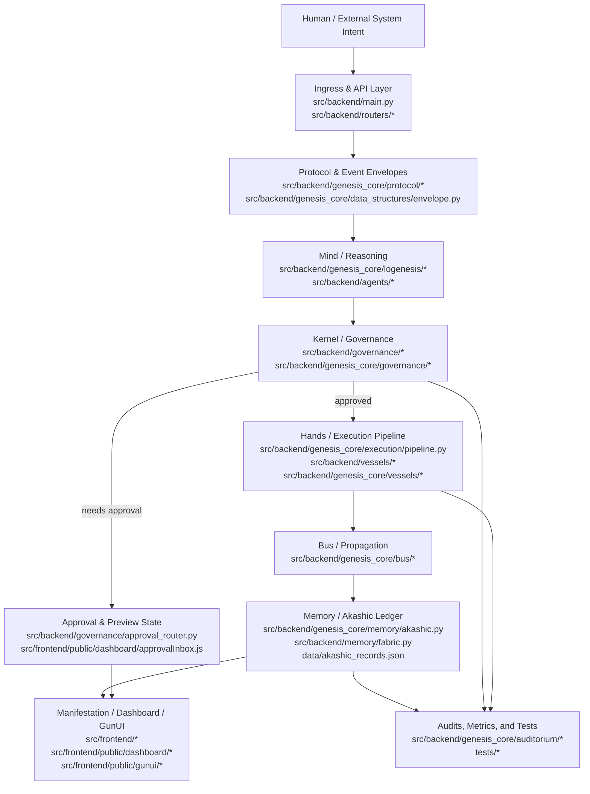

# AETHERIUM GENESIS (AG-OS)
### Unified AI-OS Platform / แพลตฟอร์ม AI-OS แบบบูรณาการ


> AETHERIUM-GENESIS is a governed AI operating layer that connects human intent, AI reasoning, policy validation, execution, memory continuity, and manifestation.

---

## 📖 Platform Overview / ภาพรวมแพลตฟอร์ม

AETHERIUM-GENESIS is not a demo-first interface or a thin LLM wrapper. It is an AI-OS platform designed to keep cognition, governance, execution, memory, and manifestation structurally aligned.

AETHERIUM-GENESIS ไม่ใช่เดโมหน้าเว็บหรือเพียงตัวห่อหุ้ม LLM แต่เป็นแพลตฟอร์ม AI-OS ที่จัดวางการรู้คิด การกำกับดูแล การปฏิบัติการ หน่วยความจำ และการแสดงผลให้เชื่อมกันอย่างมีโครงสร้าง

### Canonical subsystem map / แผนผังองค์ประกอบหลัก

- **Mind — Logenesis**: intent interpretation, reasoning, planning.
- **Kernel — Governance Core / PRGX-AG**: policy validation, risk controls, approval gates.
- **Bus — AetherBus-Tachyon**: canonical transport and correlation propagation.
- **Hands — Vessels**: execution adapters into workspaces, services, and external systems.
- **Memory — Akashic fabric**: append-only continuity, replay joins, and ledger persistence.
- **Body — GunUI / Dashboard / PWA**: render-only manifestation surfaces driven by backend directives.

- **Mind — Logenesis**: แปลความ intent และวางแผนการทำงาน
- **Kernel — Governance Core / PRGX-AG**: บังคับใช้นโยบาย จัดระดับความเสี่ยง และควบคุมการอนุมัติ
- **Bus — AetherBus-Tachyon**: โครงข่ายสื่อสารหลักพร้อมการส่งต่อ correlation
- **Hands — Vessels**: ตัวเชื่อมสำหรับลงมือปฏิบัติในระบบภายนอก
- **Memory — Akashic fabric**: บันทึกต่อเนื่องแบบ append-only รองรับ replay และ audit
- **Body — GunUI / Dashboard / PWA**: ชั้นแสดงผลที่สะท้อนสถานะจาก backend เท่านั้น

---

## 🧭 Newcomer Orientation / คู่มือเริ่มต้นสำหรับผู้มาใหม่

### What the codebase is trying to do

Think of this repository as a control plane for AI-enabled operations. A request enters as **intent**, gets interpreted by reasoning components, checked by governance, executed through adapters, committed to memory, and only then rendered in UI surfaces.

ให้มองรีโพซิทอรีนี้เป็น control plane สำหรับงานที่ขับเคลื่อนด้วย AI: คำขอเริ่มต้นจาก **intent**, ผ่านการตีความโดย reasoning, ถูกตรวจด้วย governance, ส่งต่อไป execution adapters, บันทึกลง memory แล้วจึงค่อยแสดงผลผ่าน UI

### What matters most first

1. **The control loop is the product.** Features should reinforce `Intent -> Reasoning -> Policy Validation -> Execution -> Memory Commit -> Manifestation`.
2. **Governance is not optional.** High-impact actions must remain inspectable, policy-gated, and approval-aware.
3. **Memory is architecture, not logging.** Ledger records and projections support replay, provenance, and continuity.
4. **Frontend manifests state.** UI should render backend-decided state rather than inventing semantics on the client.
5. **Protocol stability beats ad hoc convenience.** Prefer typed envelopes, canonical routes, and shared schemas.

1. **วงจรควบคุมคือหัวใจของผลิตภัณฑ์** ทุกฟีเจอร์ควรเสริมลูป `Intent -> Reasoning -> Policy Validation -> Execution -> Memory Commit -> Manifestation`
2. **Governance เป็นข้อบังคับ ไม่ใช่ทางเลือก** งานที่กระทบสูงต้องตรวจสอบได้ อยู่หลัง policy gate และรับรู้ approval
3. **Memory คือสถาปัตยกรรม ไม่ใช่ log ทั่วไป** ledger และ projection มีไว้เพื่อ replay, provenance และ continuity
4. **Frontend มีหน้าที่แสดงผลสถานะ** UI ควรสะท้อนสิ่งที่ backend ตัดสินแล้ว ไม่สร้าง semantic truth เอง
5. **Protocol ที่เสถียรสำคัญกว่าความสะดวกเฉพาะหน้า** ให้ใช้ envelope, canonical route และ schema ร่วมกันเป็นหลัก

---

## 🧠 Canonical Control Loop / วงจรควบคุมหลัก

`Intent -> Reasoning -> Policy Validation -> Execution -> Memory Commit -> Manifestation`

### Runtime guarantees / หลักประกันของระบบ

- **Envelope-first communication** via the V3 `AetherEvent` schema.
- **Governance-first execution** for destructive or high-impact actions.
- **Memory continuity** with causal chains and replay-ready ledger records.
- **Render-only manifestation** so frontend surfaces never become the semantic source of truth.

- **สื่อสารด้วย envelope เป็นหลัก** ผ่านสคีมา V3 `AetherEvent`
- **Governance มาก่อน execution** สำหรับงานที่มีผลกระทบสูงหรือย้อนกลับไม่ได้
- **หน่วยความจำต่อเนื่อง** ผ่าน causal chain และ ledger ที่ replay ได้
- **Frontend เป็นเพียงชั้นแสดงผล** ไม่ใช่ผู้กำหนดความหมายของระบบ

---

## 🏗️ System Architecture Diagram / แผนภาพสถาปัตยกรรมระบบ

The diagram below is organized around the repository's real code boundaries: ingress/API, reasoning and governance, execution adapters, append-only memory, and manifestation surfaces.

แผนภาพด้านล่างจัดตามขอบเขตโค้ดจริงในรีโพซิทอรี: ingress/API, reasoning และ governance, execution adapters, หน่วยความจำแบบ append-only และ manifestation surfaces



---

## 🗂️ Repository Layout / โครงสร้างรีโพซิทอรี

### Top-level map

- `src/backend/` — runtime entrypoints, API routers, governance, execution, memory, and integration adapters.
- `src/frontend/` — homepage, dashboard, GunUI manifestation surfaces, and static public assets.
- `docs/` — canonical specifications, roadmaps, audits, integration notes, and user-facing manuals.
- `tests/` — regression coverage for protocol, governance, memory, UI, and vessel behavior.
- `data/` — local Akashic memory artifacts and development-time persistence.
- `requirements/` — runtime, dev, and optional dependency sets.

- `src/backend/` — จุดรวม entrypoints, API, governance, execution, memory และ integration adapters
- `src/frontend/` — หน้าเว็บหลัก Dashboard GunUI และ assets ฝั่ง public
- `docs/` — เอกสารสเปกหลัก roadmap audit integration และคู่มือผู้ใช้
- `tests/` — regression tests สำหรับ protocol, governance, memory, UI และ vessel behavior
- `data/` — ไฟล์ความจำแบบ Akashic สำหรับการพัฒนาและ persistence ในเครื่อง
- `requirements/` — ชุด dependency สำหรับ runtime, dev และงานเสริม

### Backend mental model

- `src/backend/main.py` boots the FastAPI application and mounts the primary HTTP/WebSocket surfaces.
- `src/backend/routers/` contains public-facing route groups such as Aetherium, governance, entropy, and metrics.
- `src/backend/governance/` is the active governance runtime for risk-tiering, approval routing, and policy decisions.
- `src/backend/genesis_core/protocol/`, `models/`, and `data_structures/` define the canonical message and domain contracts.
- `src/backend/genesis_core/logenesis/` contains reasoning and interpreter logic.
- `src/backend/genesis_core/execution/` and `vessels/` bridge governed decisions into executable actions.
- `src/backend/genesis_core/memory/` and `src/backend/memory/` handle continuity and ledger persistence.
- `src/backend/genesis_core/bus/` carries events and propagation semantics across the platform.
- `src/backend/genesis_core/auditorium/` provides audit and observability surfaces.

### Frontend mental model

- `src/frontend/index.html` and sibling HTML files are entry surfaces for public/product views.
- `src/frontend/public/dashboard/` is the operational manifestation layer for previews, approvals, and gem panels.
- `src/frontend/public/gunui/` holds experimental or sandbox-oriented GunUI surfaces and visual manifestations.
- `src/frontend/public/manifest.json` and `sw.js` support PWA-style packaging.

### Documents worth reading early

- `docs/CANONICAL_TECHNICAL_SPEC.md` — overall contract for the platform architecture.
- `docs/directive_envelope_standard.md` — directive and envelope semantics.
- `docs/UNIFIED_AI_OS_INTEGRATION.md` — how subsystems align operationally.
- `docs/AETHERBUS_TACHYON_INTEGRATION.md` — event transport and bus integration.
- `LEGACY.md` — canonical vs legacy vs sandbox boundaries.

---

## 🔑 Important things to know / สิ่งสำคัญที่ต้องรู้

### Before you change code

- Check whether the change touches **governance**, **execution**, or **memory**; those paths need extra care because they define safety and replayability.
- Prefer extending canonical contracts over creating parallel flows.
- Avoid putting semantic business logic only in frontend files.
- Preserve correlation IDs, causation IDs, provenance, and append-only records where they already exist.
- Treat compatibility routes and sandbox pages as migration surfaces, not primary homes for new semantics.

### When reading the repository for the first time

Start in this order:

1. `README.md`
2. `docs/CANONICAL_TECHNICAL_SPEC.md`
3. `src/backend/main.py`
4. `src/backend/routers/`
5. `src/backend/governance/`
6. `src/backend/genesis_core/protocol/` and `models/`
7. `src/backend/genesis_core/execution/pipeline.py`
8. `src/backend/genesis_core/memory/akashic.py`
9. `src/frontend/public/dashboard/`
10. `tests/` for behavior examples

สำหรับการอ่านรีโพครั้งแรก แนะนำลำดับเดียวกันด้านบน เพื่อเห็นภาพจากระดับสถาปัตยกรรม ลงมาถึง runtime, protocol, governance, memory และ UI manifestation ตามลำดับ

---

## 📚 What to learn next / ควรเรียนรู้อะไรต่อไป

### If you are backend-focused

- Study the **governance flow**: risk tiering, approval routing, and governed execution.
- Trace one request end-to-end through routers, protocol envelopes, execution pipeline, and memory commit.
- Read the bus and protocol contracts before modifying integration behavior.

### If you are frontend-focused

- Learn which backend directives drive the dashboard and GunUI surfaces.
- Understand which pages are canonical versus compatibility or sandbox-only.
- Keep UI work tied to observable backend state, approval state, and replay data.

### If you are a new maintainer

- Run the focused regression tests first.
- Use tests as executable documentation for governance, protocol envelopes, and manifestation behavior.
- Review `LEGACY.md` before moving code across old and canonical paths.

### Suggested learning path

1. Read the architecture/spec docs.
2. Run the app locally.
3. Run focused tests for governance + API + frontend.
4. Trace one real route and one real test from start to finish.
5. Only then make changes to shared protocol, governance, or memory paths.

1. อ่านเอกสารสถาปัตยกรรมและสเปก
2. ลองรันระบบในเครื่อง
3. รัน focused tests สำหรับ governance + API + frontend
4. ไล่ trace เส้นทางของ route จริงหนึ่งเส้นและ test จริงหนึ่งตัวจนจบ
5. หลังจากนั้นค่อยแก้ path ที่กระทบ protocol, governance หรือ memory ร่วมกัน

---

## 🚀 Run the Platform / การรันระบบ

### 1. Install dependencies

```bash
pip install -r requirements.txt
```

Optional visual / ML extensions:

```bash
pip install -r requirements/optional-ml-visual.txt
```

Development and test tooling:

```bash
pip install -r requirements/dev.txt
```

### 2. Configure runtime

```bash
export PYTHONPATH=$PYTHONPATH:.
export BUS_IMPLEMENTATION=tachyon
export BUS_INTERNAL_ENDPOINT=tcp://127.0.0.1:5555
export BUS_EXTERNAL_ENDPOINT=ws://127.0.0.1:5556/ws
export BUS_CODEC=msgpack
export BUS_COMPRESSION=none
export BUS_TIMEOUT_MS=2000
```

### 3. Start the system

```bash
python awaken.py
```

or

```bash
python -m uvicorn src.backend.main:app --host 0.0.0.0 --port 8000
```

### 4. Core access points

- Product homepage: `http://localhost:8000`
- Operations dashboard: `http://localhost:8000/dashboard`
- API docs: `http://localhost:8000/docs`
- Public gateway: `http://localhost:8000/public`

---

## ✅ Recommended validation / ชุดตรวจสอบที่แนะนำ

```bash
pytest -q tests/test_aetherium_api.py tests/test_governance_runtime.py tests/test_governance_router.py tests/test_integration_ui.py tests/test_frontend_homepage.py
```

---

## 🔁 Canonical runtime and compatibility notes

- Runtime governance now resolves through `src/backend/governance/core.py` and `src/backend/governance/runtime.py`.
- `/ws/v3/stream` is the canonical ingress. `/ws` and `/ws/v2/stream` remain compatibility adapters and should not gain new business semantics.
- `src/backend/genesis_core/execution/pipeline.py` is the reusable helper for execution metadata validation and memory commits.
- Sandbox GunUI pages under `src/frontend/public/gunui/` are experimental unless they render backend directive envelopes directly.
- `/sandbox/gunui/*` is the explicit sandbox route. `/gunui/*` remains a compatibility alias and should not gain new semantics.
- Governance and runtime outcomes append ledger records with correlation, causation, decision status, and outcome status for replay.

---

## 📝 Migration note / บันทึกการย้ายสถาปัตยกรรม

### What is canonical now

- `src/backend/governance/*` remains the active governance runtime path for policy evaluation, approval routing, and governed ingress.
- `src/backend/genesis_core/execution/pipeline.py` is the shared execution contract for metadata validation and audit/memory commit behavior.
- Backend-provided governance state, directive state, and replay metadata remain the semantic source of truth for manifestation.

### What remains legacy or sandbox

- `/ws` and `/ws/v2/stream` are compatibility-only sockets.
- `/gunui/*` is a compatibility mount; sandbox-facing usage should move to `/sandbox/gunui/*`.
- Duplicate backend roots outside `genesis_core` remain for compatibility and should avoid new business logic unless required for migration.

See also: [LEGACY.md](LEGACY.md) for the canonical vs legacy vs sandbox matrix.

---

## 📚 Core documents / เอกสารหลัก

- [docs/CANONICAL_TECHNICAL_SPEC.md](docs/CANONICAL_TECHNICAL_SPEC.md)
- [docs/directive_envelope_standard.md](docs/directive_envelope_standard.md)
- [docs/UNIFIED_AI_OS_INTEGRATION.md](docs/UNIFIED_AI_OS_INTEGRATION.md)
- [docs/AETHERBUS_TACHYON_INTEGRATION.md](docs/AETHERBUS_TACHYON_INTEGRATION.md)
- [docs/ARCHITECTURE_AUDIT.md](docs/ARCHITECTURE_AUDIT.md)

© 2026 Aetherium Syndicate Inspectra (ASI)
