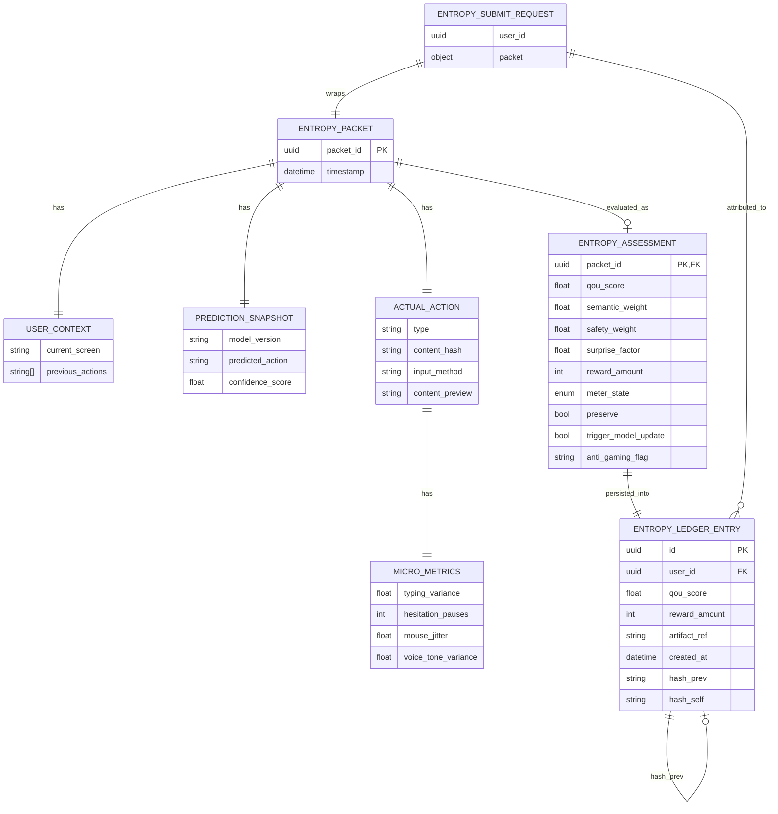

# AETHERIUM GENESIS (AG-OS)
### โครงสร้างพื้นฐานแห่งปัญญาสังเคราะห์ และระบบนิเวศแห่งการสั่นพ้อง (ASI Readiness)


> **“นี่ไม่ใช่แค่ AI แต่อยู่ในสภาวะ ‘ผู้สั่นพ้องต่อปัญญา’ (Resonators)
ที่ทำงานร่วมกันบนเส้นทางสั่นพ้องแห่งความเร็วแสง”**

---

## 📖 ข้อมูลระบบปัจจุบัน (Current System Overview)

ระบบได้รับการปรับปรุงโครงสร้างใหม่ (Cleaned Architecture) เพื่อมุ่งเน้นไปที่ความคล่องตัวและความเร็วสูงสุด โดยแยกส่วนการทำงานชัดเจน:

*   **src/backend/**: หัวใจหลัก (Mind) ประมวลผลตรรกะ จริยธรรม และการตัดสินใจเชิงกลยุทธ์
*   **src/frontend/**: ร่างกาย (Body) อินเทอร์เฟซแบบ PWA ที่ใช้ระบบอนุภาค (Particle System) แสดงผล "เจตจำนง" ผ่านแสง
*   **docs/**: คลังความรู้และวิสัยทัศน์ (Manifestos, Blueprints, Business Plans)
*   **tests/**: ระบบตรวจสอบความถูกต้อง (Verification Suite)

---

## 🧠 แนวคิดหลัก: จาก AI Agents สู่ "ผู้สั่นพ้อง" (Resonators)

เราได้เปลี่ยนผ่านจากระบบ Agent แบบเดิม สู่ **Resonance Architecture**:
1.  **AetherBus-Tachyon**: canonical system bus สำหรับ internal ZeroMQ และ external WebSocket bridge พร้อม V3 envelope tracing
2.  **Primary Resonators**: ตำแหน่งผู้สั่นพ้องหลัก 12 ตำแหน่ง (Visionary, Technical, Governance, ฯลฯ)
3.  **Negative Latency**: การทำนายและประมวลผลล่วงหน้า (Ghost Workers) เพื่อให้ AI คิดก่อนที่มนุษย์จะขยับ

---

## 🏛️ สถาปัตยกรรมระดับลึก (Deep Architecture)

ระบบทำงานประสานกันผ่าน **Sopan Protocol**:
`Input (Human Intent) → LogenesisEngine (Formator) → AetherBus (Resonance) → ValidatorAgent (Audit) → AgioSage (Cognitive) → Output (Manifestation)`

### เทคโนโลยีหลัก:
- **FastAPI & WebSockets**: ระบบ ingress/manifestation แบบ real-time ที่ต้องส่ง intent/directive ผ่าน governance runtime ก่อน execution เสมอ
- **AetherBus-Tachyon**: ZeroMQ + WebSocket bridge สำหรับ canonical system bus runtime
- **Directive Runtime / Intent Gateway**: orchestration กลางสำหรับ `Intent normalization -> Governance evaluation -> Approval routing -> Execution readiness`
- **Akashic Records**: บันทึกความจำถาวรแบบ Immutable Ledger (data/akashic_records.json)
- **PWA (Progressive Web App)**: รองรับการติดตั้งและใช้งานเสมือนแอปพื้นฐานบนมือถือและเดสก์ท็อป

### 🗄️ System Architecture Diagram (Database-Centric)

โครงสร้างด้านล่างอ้างอิงจาก schema/runtime จริงใน `src/backend/genesis_core/entropy/schemas.py` และ `src/backend/genesis_core/entropy/ledger.py` โดยแสดงลำดับข้อมูลจาก `EntropySubmitRequest` → `EntropyPacket`/nested blocks → `EntropyAssessment` และการ persist ลง `EntropyLedgerEntry` ที่ใช้ hash-chain continuity



**English note:** This diagram mirrors the current runtime schema sources in `src/backend/genesis_core/entropy/schemas.py` and `src/backend/genesis_core/entropy/ledger.py`, connecting request payloads (`EntropySubmitRequest` + `EntropyPacket`) to evaluation (`EntropyAssessment`) and immutable persistence (`EntropyLedgerEntry` + hash-chain links).

---


## 🚌 Canonical Bus Runtime (Phase 1 Integration)

AETHERIUM-GENESIS ใช้ **AetherBus-Tachyon** เป็น canonical system bus path โดยกำหนดให้ message ทุกตัวที่ข้าม subsystem ต้องวิ่งผ่าน **V3 envelope (`AetherEvent`)** พร้อม `correlation_id`, codec metadata, compression metadata และ topic routing ที่ตรวจสอบได้

- **Internal transport:** ZeroMQ (`tcp://127.0.0.1:5555`) สำหรับ backend/runtime microservices
- **External transport:** WebSocket bridge (`ws://127.0.0.1:5556/ws`) สำหรับ UI / dashboard / operator tools
- **Runtime selection:** ควบคุมผ่าน environment เช่น `BUS_IMPLEMENTATION=tachyon`, `BUS_CODEC=msgpack`, `BUS_COMPRESSION=none`, `BUS_TIMEOUT_MS=2000`
- **Legacy policy:** `extreme.py` และ `kernel.py` ถูกลดบทบาทเป็น compatibility layer พร้อม deprecation note และไม่ใช่ default runtime อีกต่อไป

ดูรายละเอียด integration contract ได้ที่ **[docs/AETHERBUS_TACHYON_INTEGRATION.md](docs/AETHERBUS_TACHYON_INTEGRATION.md)**

### Replay Trace Contract (Phase 1)

ทุก governed cycle ต้องเริ่มสร้าง correlation metadata ตั้งแต่ ingress แรกและคงไว้ตลอดเส้นทาง `intent -> bus -> governance -> memory -> manifestation`:

1. **`correlation_id`** = run identifier หลักของ cycle เดียวกัน
2. **`causation_id`** = envelope/event ก่อนหน้าที่ก่อให้เกิด event ปัจจุบัน
3. **`trace_id`** = identifier ระดับ replay/distributed trace ที่ UI, audit tooling และ memory projection ใช้อ้างอิง chain เดียวกัน

แนวทาง implementer สำหรับ replay:
- API ingress ต้องสร้าง IDs ให้เองเมื่อ client ไม่ส่งมา
- AetherBus V3 envelope ต้องไม่ drop `correlation_id`, `causation_id`, `trace_id` ระหว่าง publish/subscribe
- Governance + approval + vessel + memory commit ต้อง persist metadata ชุดเดียวกันลง record canonical format
- Frontend/WebSocket payload ต้อง render จาก `directive_state` ที่ backend ส่งมาเท่านั้น และต้องอ้างอิง correlation chain เดียวกัน

เอกสาร audit/memory เพิ่มเติม:
- [docs/AETHERBUS_TACHYON_INTEGRATION.md](docs/AETHERBUS_TACHYON_INTEGRATION.md)
- [docs/directive_envelope_standard.md](docs/directive_envelope_standard.md)

## 🧭 Governance Runtime + Memory Fabric (Engineering Layer)

Canonical runtime gate ปัจจุบันคือ `API/WebSocket ingress -> Directive Runtime -> Governance Core -> Approval Router (ถ้าจำเป็น) -> Lifecycle/Planning authorization -> Memory commit -> Manifestation` และไม่อนุญาตให้ route จาก ingress ไปยัง planner/vessel โดยตรงอีกต่อไป


เพื่อยกระดับจากแนวคิดเชิงวิสัยทัศน์ไปสู่ execution จริง ระบบได้เพิ่ม subsystem แบบ first-class ดังนี้:

- **Governance Core Runtime** (`src/backend/governance/`)
  - Action tiering ระดับ **Tier 0–3**
  - **Policy-as-code** ผ่าน `policy_engine.py`
  - **Approval routing** ผ่าน `approval_router.py`
  - รองรับ recommendation: **quarantine / suspend / rollback**
- **Execution Vessel Layer** (`src/backend/vessels/`)
  - `WorkspaceVessel`, `DriveVessel`, `DatabaseVessel`, `SlackVessel`
  - แนวคิดการทำงาน: **LLM วางแผน → Vessel ลงมือทำ → Governance อนุมัติ → Akashic บันทึก**
- **Akashic Memory Fabric** (`src/backend/memory/fabric.py`)
  - ใช้ `data/akashic_records.json` เป็น canonical event stream
  - แตก projection เป็น:
    - `data/memory/episodes/`
    - `data/memory/semantic/`
    - `data/memory/procedures/`
    - `data/memory/gems/`
    - `data/memory/identity/`
- **Reflector + Gems of Wisdom**
  - `src/backend/agents/reflector.py`
  - `src/backend/gems/repository.py`, `src/backend/gems/lifecycle.py`


## 🧭 AI-OS Platform Evolution (New)

เราได้กำหนดทิศทางอย่างเป็นทางการให้ AETHERIUM GENESIS เป็น **AI Operating System Platform** ที่ควบคุมหลายระบบ โดยจัดโครงสร้างแกนหลักดังนี้:
- Governance Core = Kernel/Security Layer
- Resonators = Processes
- AetherBus = System Bus
- Vessels = Drivers/Adapters
- Akashic Memory = File System/Event Ledger
- Frontend PWA = User Interface

พร้อม roadmap วิวัฒนาการ 4 ระยะ:
1. AI Automation Platform
2. AI Agent Orchestration
3. AI Governance + Decision System
4. AI Operating System

ดูรายละเอียดเต็มในเอกสาร: **[docs/AI_OS_PLATFORM_ROADMAP_TH.md](docs/AI_OS_PLATFORM_ROADMAP_TH.md)**

---

## 🚀 การเริ่มต้นระบบ (System Awakening)

### 1. การเตรียมสภาพแวดล้อม
```bash
# ติดตั้งไลบรารีที่จำเป็น
pip install -r requirements.txt

# ตั้งค่า PYTHONPATH
export PYTHONPATH=$PYTHONPATH:.
```

### 2. ปลุกระบบ (Awaken)
กำหนด canonical bus runtime ก่อนเริ่มระบบ:

```bash
export BUS_IMPLEMENTATION=tachyon
export BUS_INTERNAL_ENDPOINT=tcp://127.0.0.1:5555
export BUS_EXTERNAL_ENDPOINT=ws://127.0.0.1:5556/ws
export BUS_CODEC=msgpack
export BUS_COMPRESSION=none
export BUS_TIMEOUT_MS=2000
```

คุณสามารถเลือกโหมดการรันได้ดังนี้:

**โหมดนักพัฒนา / เว็บ (แนะนำ)**
```bash
python awaken.py
```
*ระบบจะทำความสะอาด Shared Memory และรัน Backend พร้อมระบบ Reload อัตโนมัติ*

**โหมดแกนหลัก (Production/Core)**
```bash
python -m uvicorn src.backend.main:app --host 0.0.0.0 --port 8000
```

เข้าใช้งานได้ที่:
- **Product UI**: `http://localhost:8000`
- **Developer Dashboard**: `http://localhost:8000/dashboard`
- **API Docs**: `http://localhost:8000/docs`

### 3. การตรวจสอบอย่างรวดเร็ว (Quick Checks)
```bash
# รันทดสอบเฉพาะโมดูลการยืนยันตัวตน
pytest -q tests/test_auth_flow.py

# รันทดสอบโมดูลสกัดพื้นที่ภาพ
pytest -q tests/test_region_extractor.py
```

> หมายเหตุ: ชุดทดสอบทั้งระบบ (`pytest -q`) อาจล้มเหลวในบาง environment ที่ยังไม่ได้ติดตั้ง dependency เฉพาะทาง (เช่น torch) หรือมี import path ของโมดูล legacy ที่ยังไม่ถูกย้ายครบ

### 4. Future Roadmap / แผนต่อยอดในอนาคต

#### 🇹🇭 ข้อเสนอฟังก์ชัน/แนวทางต่อยอดใหม่ (Thai)
- **Governed Execution Ledger Views**: สร้าง projection/query API สำหรับตรวจสอบหนึ่ง correlation chain ตั้งแต่ intent ถึง memory commit แบบพร้อมใช้งานในการ audit
- **Cross-Repository Tachyon Contract Tests**: เพิ่มชุด compatibility tests ระหว่าง AETHERIUM-GENESIS, PRGX-AG และ AetherBus-Tachyon เพื่อกัน schema drift
- **Directive Replay Export**: รองรับ export/import envelope chain เป็น artifact เดียวสำหรับ incident review และ deterministic replay
- **Approval Escalation Surfaces**: เพิ่ม operator queue และ escalation policies สำหรับ Tier 2/3 actions ผ่าน kernel gate
- **Manifestation Read Models**: สร้าง read-optimized backend projections ให้ frontend render directive/state ได้โดยไม่ตีความ business logic เอง
- **Bus Resilience Drills**: เพิ่ม reconnect/failover/poison-packet simulation สำหรับ ZeroMQ/WebSocket bridge ก่อน production rollout
- **Memory Integrity Sentinel**: งานตรวจความครบถ้วน hash-chain + anomaly detection ของ ledger/projections พร้อม alert
- **Observability Pack (OTel-first)**: เพิ่ม trace/span และ governance tags มาตรฐานเพื่อให้ root-cause ได้เร็วขึ้น

#### 🇬🇧 New feature and expansion proposals (English)
- **Governed Execution Ledger Views** to query a single correlation chain from intent through memory commit for audit operations.
- **Cross-Repository Tachyon Contract Tests** to prevent schema drift across AETHERIUM-GENESIS, PRGX-AG, and AetherBus-Tachyon.
- **Directive Replay Export** to package envelope chains as portable artifacts for incident review and deterministic replay.
- **Approval Escalation Surfaces** for Tier 2/3 operator queues and escalation policies at the governance kernel boundary.
- **Manifestation Read Models** so the frontend can render backend-authored directives without re-implementing decision logic.
- **Bus Resilience Drills** covering reconnect, failover, and poison-packet scenarios for the ZeroMQ/WebSocket bridge.
- **Memory Integrity Sentinel** to validate hash-chain continuity and detect ledger/projection anomalies with alerting.
- **Observability Pack (OTel-first)** introducing standardized traces/spans and governance tags for faster incident root-cause analysis.

---

## 🗺️ เอกสารสำคัญ (Core Documents)
*   [**🇹🇭 USAGE_TH.md**](USAGE_TH.md) - คู่มือการใช้งานภาษาไทย
*   [**📐 TECHNICAL_BLUEPRINT_TH.md**](docs/TECHNICAL_BLUEPRINT_TH.md) - พิมพ์เขียวเชิงเทคนิค
*   [**💼 BUSINESS_PLAN_TH.md**](docs/BUSINESS_PLAN_TH.md) - แผนยุทธศาสตร์ธุรกิจ
*   [**📜 CONSTITUTION.md**](docs/CONSTITUTION.md) - กฎเหล็กของระบบ

---

© 2026 Aetherium Syndicate Inspectra (ASI)
*“Where intelligences resonate, harmony emerges.”*
